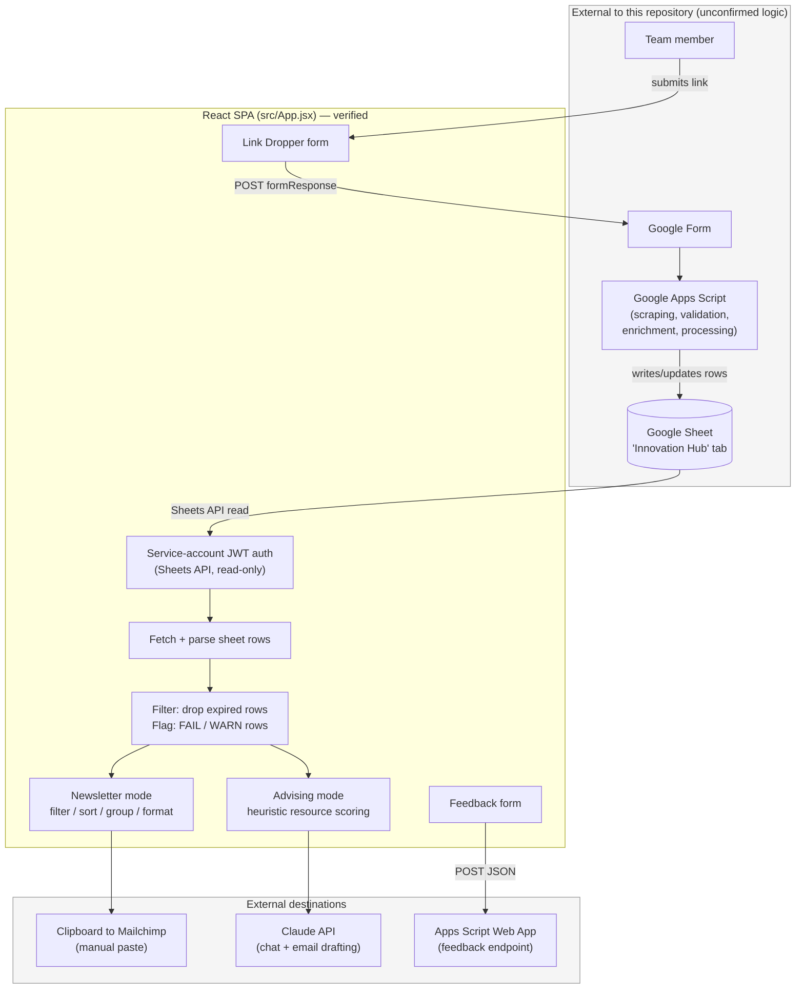

# Innovation Hub Advisor — System Flow

_Last analyzed: 2026-08-23. This document distinguishes behavior verified directly from this repository's source code and git history from behavior that occurs in the external Google Apps Script / Google Forms pipeline and cannot be confirmed here._

## 1. High-Level Overview

The Innovation Hub Advisor Tool is a **client-only React single-page application** (React 19 + Vite), deployed as a static site to GitHub Pages. It has no backend/server component in this repository — all logic runs in the browser.

The app has four modes, all built around one Google Sheet ("Innovation Hub" tab):

- **Newsletter** — filters resources marked for this week, formats and groups them for Mailchimp.
- **Advising** — matches sheet resources to free-text advising notes using local keyword/rule scoring, then optionally drafts a follow-up email via the Claude API.
- **Link Dropper** — a form for submitting new opportunities/resources into the team's intake process.
- **Feedback** — a form for submitting user feedback/feature requests.

The Google Sheet is the single source of truth. Web scraping, URL validation, data enrichment, and writing new/processed rows into the Sheet are handled by **Google Apps Script and Google Forms that are not included in this repository** — this app only reads the Sheet and writes to two external endpoints (a Form and an Apps Script Web App).

## 2. End-to-End Data Flow

Each step is labeled **[Verified]** (confirmed directly from this repo's code) or **[External — unconfirmed]** (inferred from column names, README text, or endpoint usage, but implemented outside this repository where it cannot be inspected).

1. **[External — unconfirmed]** A team member submits a resource via the app's Link Dropper form, which posts to a Google Form. Form responses are presumably processed further by Google Apps Script.
2. **[External — unconfirmed]** Scraping, URL validation, and enrichment populate columns such as `Resource Type [External Search]`, `Failure Message`, and `Removal Date [Internal]`. The logic that does this is not present in this repository.
3. **[Verified]** Data is stored in the Google Sheet, in the **"Innovation Hub"** tab, which the app reads directly.
4. **[Verified]** On load, the app authenticates as a Google service account, requests an OAuth token, and reads the "Innovation Hub" tab (columns A–T) via the Sheets API using a read-only scope.
5. **[Verified]** Parsing treats row 1 as column descriptions, row 2 as real headers, and all rows below as data.
6. **[Verified]** Client-side filtering:
   - Rows whose `Removal Date [Internal]` is in the past are dropped immediately on load — this is the app's only form of "expiration"/"archival"; there is no archive view in the app.
   - Rows with a `Failure Message` containing `[FAIL` or `[WARN` are flagged for manual review but are *not* removed — they're surfaced in the UI for a human to judge.
7. **[Verified]** Newsletter mode filters to rows marked "Newsletter this week?", applies sidebar filters (industry, type, role type/tag, Metcalf flag, newsletter category, removal-date range), formats and sorts rows (priority flag first, then soonest removal date, then title), groups by resource type, and lets the user select rows and copy Mailchimp-ready text to the clipboard. Flagged rows can be included/excluded from the copied output via a toggle.
8. **[Verified]** Advising mode combines advisor notes, session type, and preferences into a local heuristic scoring function (keyword/tag matching, no AI) that ranks live, non-expired resources. The advisor selects resources, and an optional call to the Claude API drafts a follow-up email using the notes and selected resources.
9. **[Verified]** Link Dropper submission POSTs new resource details to a Google Form endpoint. The POST uses `no-cors` mode, so the app cannot confirm success from Google's response — it optimistically reports success and only checks that the submitted URL string starts with `http`.
10. **[Verified]** Feedback submission POSTs form data as JSON to a Google Apps Script Web App endpoint.
11. **[Verified]** Deployment: `npm run build` (Vite) produces `dist/`, then `npm run deploy` (or `deploy.sh`) publishes `dist/` to GitHub Pages via the `gh-pages` package.

## 3. Mermaid Flowchart

## 4. Major Components

| Component | Status | Description |
| --- | --- | --- |
| React SPA (`src/App.jsx`) | Verified | The entire application logic and UI: Sheets auth, data fetch/parse, expiration/flag logic, newsletter formatting, advising scoring engine, Claude API calls, and both external form submissions. |
| Google Sheet | Verified | Single source of truth ("Innovation Hub" tab). Read-only from the app's perspective. |
| Google Apps Script | External — unconfirmed | Presumed to perform scraping, URL validation, enrichment, and writing rows into the Sheet, and to host the Web App endpoint used for Feedback submissions. Source not included in this repository. |
| Google Form | Verified (endpoint usage only) | Intake endpoint for Link Dropper submissions; downstream processing of responses is external and unconfirmed. |
| Claude API | Verified (call site only) | Used for the in-app advising chat assistant and for drafting advising follow-up emails, called directly from the browser. |
| GitHub Pages | Verified | Static hosting for the built app (`dist/`). |

## 5. Important Files and Responsibilities

| File | Responsibility |
| --- | --- |
| `src/App.jsx` | Core application: Sheets auth, data fetch/parse/filter, newsletter formatter, advising scoring engine, Claude API calls, Link Dropper + Feedback submission, and all UI/state. |
| `src/main.jsx` | React entry point; mounts `<App/>`. |
| `advisor-tool.jsx` | An earlier/duplicate standalone copy of the app; not referenced by the build. Appears to be a stale, orphaned file. |
| `src/App.jsx.backup`, `.backup2`, `.backup3`, `.backup_jul28` | Historical snapshots of `App.jsx` from earlier development iterations; not used by the build but tracked in git. |
| `vite.config.js` | Vite config: GitHub Pages base path, custom cache-busted output filenames. |
| `package.json` | Scripts (`dev`, `build`, `preview`, `deploy`, `lint`) and dependencies (React 19; no backend/Google SDK — raw `fetch` used throughout). |
| `dist/` | Committed production build output; the exact bundle served on GitHub Pages. |
| `deploy.sh` | Wrapper script: build then deploy to GitHub Pages via `gh-pages`. |
| `patch_advising.py` | Misnamed — content is HTML/CSS/JS from a Google account sign-in page, not Python. Not part of the app; appears to be an accidental artifact. |
| `scripts/code-modifications/*.py` | Roughly 50 one-off, throwaway Python scripts that performed text find/replace edits directly on `src/App.jsx` during development. Not invoked by the build or by each other; historical dev tooling only. |
| `README.md` | Project overview, live URL, setup/build/deploy instructions, and a warning against storing secrets in the code. |
| `index.html`, `public/` | Static HTML shell and static assets (favicon, icons). |

## 6. Google Sheet Tabs, Columns, and Triggers

**Tab read by the app (Verified):** `Innovation Hub` (only tab referenced in code), range `A:T`.

**Columns referenced in the app's code (Verified):**

| Column | Used for |
| --- | --- |
| `Title` | Resource display name |
| `URL` | Resource link |
| `Resource Type [External Search]` | Newsletter/advising grouping and filtering |
| `Employer/Host` | Display |
| `Location` | Display and advising location matching |
| `Date` | Display (event/deadline date) |
| `One-liner` | Description text |
| `Industry` | Filtering / advising matching |
| `Role Type` | Filtering |
| `Role Tag` | Filtering / advising matching |
| `Metcalf?` | Newsletter sort priority flag |
| `Newsletter this week?` | Newsletter inclusion filter |
| `Newsletter Type` | Newsletter category filter |
| `Removal Date [Internal]` | Expiration filter and newsletter sort |
| `Failure Message` | Manual-review flag (`[FAIL`/`[WARN` substrings) |
| `Employer AI Tag` | Advising scoring |

**Row structure (Verified):** Row 1 = column descriptions, Row 2 = actual headers, Row 3+ = data.

**Triggers (External — unconfirmed):** No triggers, cron jobs, or CI/CD workflows exist in this repository — there is no `.github/workflows/` directory. Any sheet-level triggers (onEdit, time-driven Apps Script triggers) would live in the external Apps Script project and cannot be confirmed from this repository.

## 7. External Services and Configuration

- **Google Sheets API v4** (Verified) — `spreadsheets.readonly` scope; service-account JWT signed client-side via Web Crypto.
- **Google Forms** (Verified, endpoint only) — one form endpoint for Link Dropper submissions (three named entry fields plus an email field).
- **Google Apps Script Web App** (Verified, endpoint only) — one endpoint used for Feedback submissions in current code.
- **Anthropic Claude API** (Verified, call site only) — called directly from the browser for the advising chat assistant and email drafting. No authentication header is present in either call site in the current code, which would cause requests to be rejected by the API as written (see Section 8).
- **GitHub Pages** (Verified) — static hosting, deployed via the `gh-pages` npm package; base path configured in `vite.config.js`.
- **Configuration approach** (Verified) — all identifiers (spreadsheet ID, endpoint URLs, model name) are hardcoded constants at the top of `src/App.jsx` rather than environment variables; there is no `.env`/`import.meta.env` usage in the app.

### Security Note

This repository currently hardcodes a Google service-account private key directly in source files (`src/App.jsx`, its backup copies, and `advisor-tool.jsx`), and that key is also embedded in the committed production build (`dist/`), which is the exact bundle served publicly on GitHub Pages. No credential values are reproduced in this document. This should be treated as a live exposure: the key should be rotated in Google Cloud IAM, removed from all tracked files (including build output and backups), and scrubbed from git history, independent of any other work described here.

## 8. Verified Limitations and Items Needing Confirmation

### Verified from this repository

- The app only *reads* the "Innovation Hub" tab; it never writes rows back to it directly.
- Expiration is enforced purely client-side by dropping rows with a past `Removal Date [Internal]` on load — there is no archive tab or export step visible in this repo.
- Flagged rows are surfaced for manual review, not auto-excluded.
- Link Dropper's success confirmation is not real (the Form POST uses `no-cors`, so the response can't be inspected); only a client-side `startsWith("http")` check is performed on the submitted URL.
- `dist/` (the deployed bundle) is tracked in git despite being listed in `.gitignore`, meaning it continues to be committed on every deploy.
- A Google service-account private key is hardcoded in multiple tracked files and in the deployed build (see Security Note above).

### Requires confirmation from the external Apps Script project / team

- The actual scraping/enrichment logic that populates `Resource Type [External Search]`, `Failure Message`, and other derived columns.
- The exact rules that decide `[FAIL]` vs `[WARN]` and what triggers each.
- How and where new Link Dropper or Feedback submissions are reconciled into the "Innovation Hub" tab.
- Whether `Removal Date [Internal]` is entered manually or computed from another field.
- Whether removed/expired rows are archived anywhere (a separate tab, log, or export) or simply become invisible once this app filters them out.
- Whether the Claude API calls function in production given the apparent lack of an authentication header in the client code — this may indicate a proxy layer not present in this repo, or a non-functional/incomplete feature.
- Any Apps Script source, Google Form field/tab definitions beyond the entry IDs referenced in code, and any sheet-level formulas, validation, or protections.
